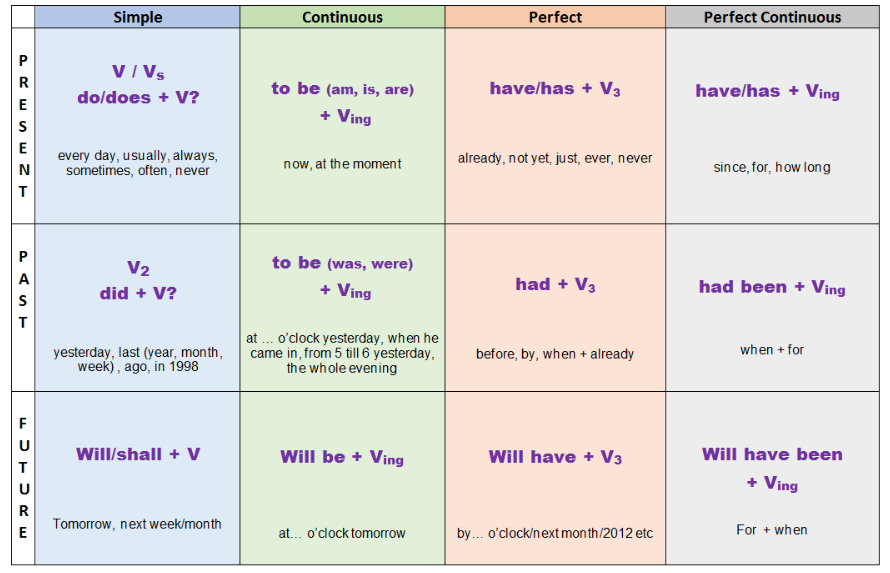
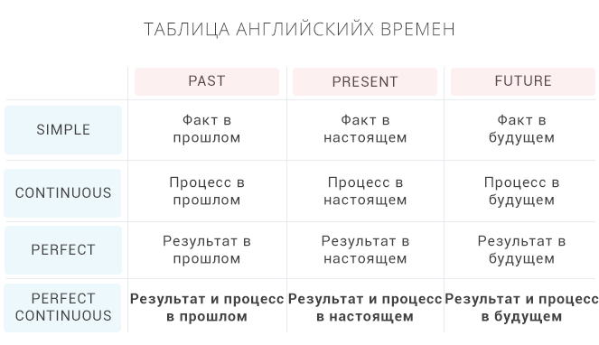
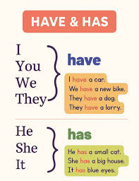
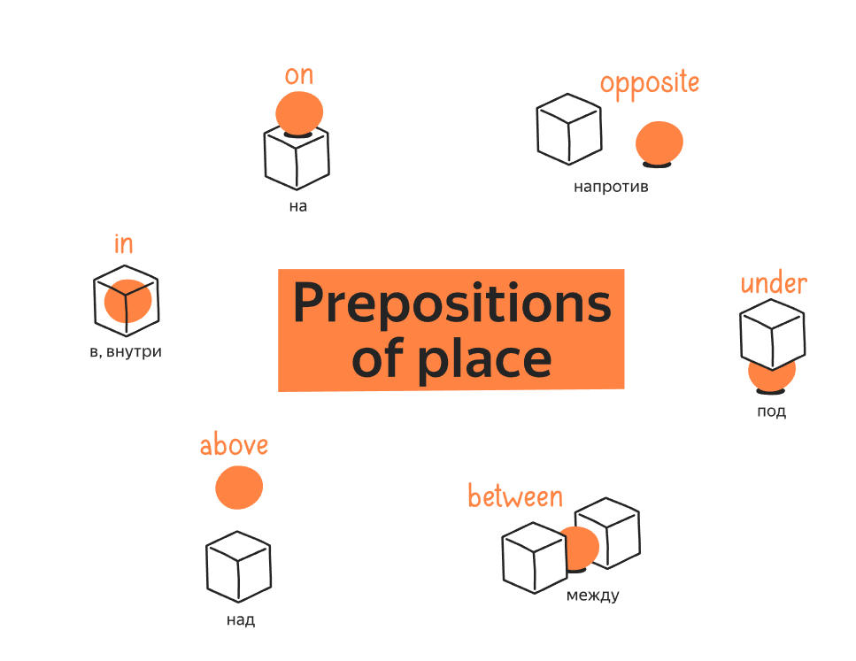
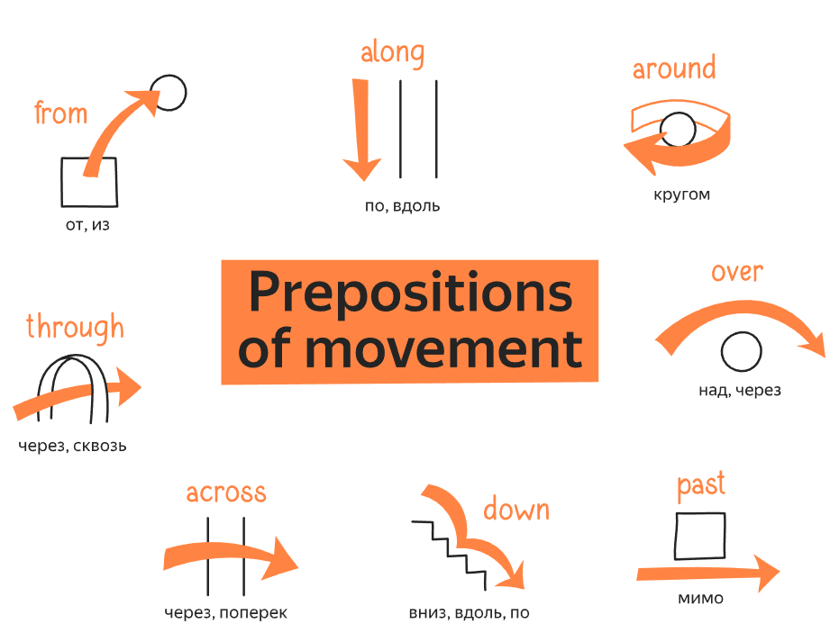
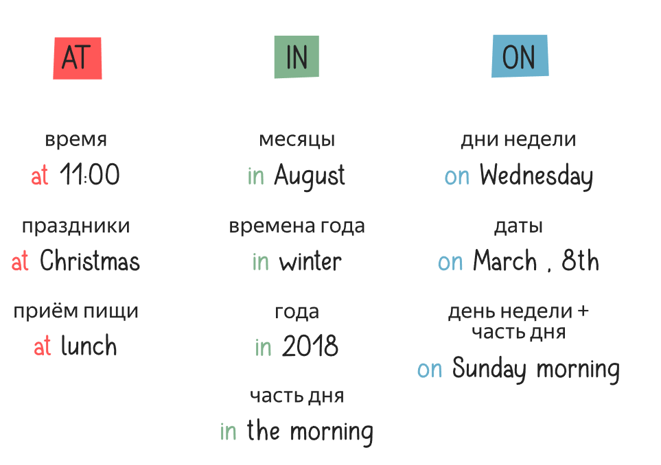

# Important notes
- *they* applicable for people and things too (e.g. they are 5 books)

# Grammar
- noun
  - common noun (e.g. student)
  - proper noun (e.g. Mary, Kronshtadtsky Boulevard) (always start with a capital char)
  - pronoun (e.g. he/she/it/they/you)
- verb
  - be (am is are) (connects the subject and it's information). We use BE to connect a subject with more information about it
    - contraction (e.g. `She's` instead of `she is`) - just a combination of two words at one
- adjective
## Articles
  - a - for a words starting with a consonant
  - an - for a words starting with a vowels
  - the
    - specific (the book on the table)
    - already known (I saw a dog. The dog was barking)
    - unique (the sun, the internet)

### When not to use
- with plural nouns
- with uncountable nouns
- with verbs

------------

# Tenses
[The best book ever](tenses.pdf)

He/She/It - Vs
## Present Simple
***When to use***:
- Routine (something u do every day)

How to build:
- V/Vs

## Past Simple
## Future Simple

## Present Continuous
When to use:
- Actions we want to show **irritation** (exmp: "You're **always** interrupting me")
- Actions planned on future
- Action happens right now

How to build:

## Past Continuous
## Future Continuous

## Present Perfect
## Past Perfect
## Future Perfect

## Present Perfect Continuous
## Past Perfect Continuous
## Future Perfect Continuous

# Other

